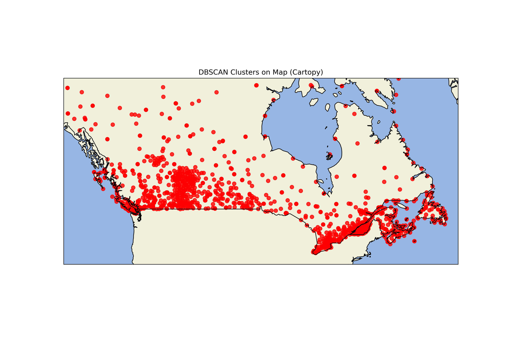

# ML_Projects
Projects that I used to evaluate myself

# 🌦️ DBSCAN Weather Station Clustering

این پروژه از الگوریتم **DBSCAN** برای خوشه‌بندی **ایستگاه‌های هواشناسی** بر اساس موقعیت جغرافیایی استفاده می‌کند و نتایج را به‌صورت گرافیکی روی نقشه با استفاده از **Cartopy** نمایش می‌دهد.

---

## 📌 اهداف پروژه

- خوشه‌بندی ایستگاه‌ها با الگوریتم Density-Based (DBSCAN)
- تشخیص نقاط نویز (Outliers) در داده‌های مکانی
- مصورسازی نتایج خوشه‌بندی روی نقشه‌ای واقعی
- تحلیل دمای میانگین هر خوشه

---

## 🖼️ نمونه خروجی

<div align="center">
  
</div>

---

## 📂 ساختار فایل‌ها

| فایل | توضیح |
|------|-------|
| `DBSCAN_WeatherStation.ipynb` | نوت‌بوک اصلی شامل مراحل کامل کدنویسی و اجرای مدل |
| `cluster_map.png` | خروجی تصویری خوشه‌بندی |
| `requirements.txt` | لیست کتابخانه‌های مورد نیاز برای اجرای پروژه |

---

## 🧰 ابزارها و کتابخانه‌ها

- Python 3.x
- Pandas
- NumPy
- Matplotlib
- scikit-learn
- Cartopy

---

## 🛠 نصب و اجرا

۱. نصب پیش‌نیازها:

```bash
pip install -r requirements.txt
