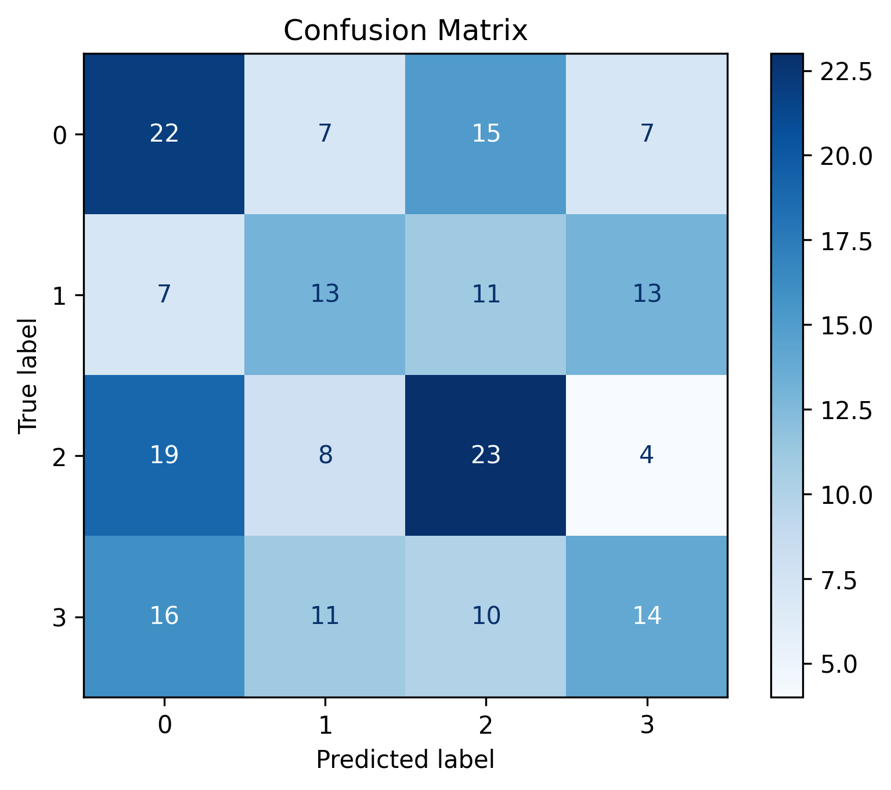

# 🧩 دسته‌بندی مشتریان (Customer Categorization)

این پروژه از مدل‌های یادگیری ماشین برای **دسته‌بندی مشتریان** استفاده می‌کند.

---

## 🎯 اهداف پروژه
- بارگذاری دادهٔ مشتریان
- آموزش مدل‌های دسته‌بندی (مثلاً Logistic Regression, RandomForest, SVM)
- ارزیابی مدل با معیارهایی مثل دقت و ماتریس درهم‌ریختگی (Confusion Matrix)

---

## 🛠 پیش‌نیازها
- Python 3.9+
- Jupyter Notebook
- numpy • pandas • scikit-learn • matplotlib • seaborn

نصب سریع:
```bash
pip install -r requirements.txt
```

---

## 🚀 اجرا
```bash
jupyter notebook notebook.ipynb
```

---

## 📊 نمونه خروجی (Confusion Matrix)


---

## 📬 ارتباط
برای پیشنهاد یا سؤال می‌توانید از Issues همین مخزن استفاده کنید.
